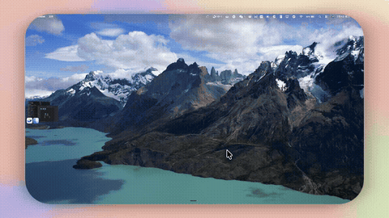

[**English**](README.md) | 中文

# DropKit

> DropKit 是一款 macOS 菜单栏工具，提供「拖拽时摇晃鼠标唤出」的悬浮文件暂存架和可搜索的剪贴板历史。




---

## 为什么需要 DropKit？

在 macOS 上跨应用移动文件一直很繁琐：打开 Finder、调整窗口、拖过去……整个过程会打断当前工作。DropKit 用一个悬浮暂存架解决这个问题——拖文件时摇晃鼠标，架子立刻弹出，不需要切换窗口。配套的剪贴板历史面板让你复制过的文字、图片、文件随时可查可粘贴。

---

## 功能特性

### 悬浮文件暂存架
- 拖拽文件时左右摇晃鼠标，即可立即唤出悬浮架
- 把文件暂放在架子上，随时拖出到目标位置
- 支持宫格和列表两种视图模式
- 可折叠为紧凑浮层，也可展开查看所有暂存文件

### 剪贴板历史
- 自动监控剪贴板——文本、图片、文件、链接，复制即捕获
- 全文搜索历史记录
- 置顶重要条目，防止被自动清理
- 按空格键快速预览选中条目
- 可在设置中配置最大条目数和保留天数
- 自动跳过密码管理器的隐藏类型（`ConcealedType`）和应用黑名单，不记录敏感内容

### 菜单栏集成
- 常驻菜单栏图标，随时访问
- 全局键盘快捷键，在任何应用中均可触发
- 后台运行，不占 Dock 位置，极低资源占用

---

## 快速开始 / 安装

DropKit 正在准备上架 Mac App Store。在商店版本发布前，请通过源码构建安装：

### 环境要求

| 依赖 | 版本 |
|------|------|
| macOS | 14.0 (Sonoma) 及以上 |
| Xcode | 15.0 及以上 |
| XcodeGen | 最新版（`brew install xcodegen`） |

### 从源码构建

```bash
git clone https://github.com/chenhuajinchj/DropKit.git
cd DropKit/DropKit
xcodegen generate          # 从 project.yml 生成 DropKit.xcodeproj
xcodebuild -scheme DropKit -configuration Release build
```

构建产物 `DropKit.app` 位于 `build/Release/` 目录，移动到 `/Applications` 后启动即可。

### 授予辅助功能权限

DropKit 需要辅助功能权限来检测鼠标摇晃手势：

1. 打开 **系统设置 → 隐私与安全性 → 辅助功能**
2. 点击锁图标并验证身份
3. 在列表中启用 DropKit
4. 重启 DropKit 使更改生效

不授予此权限时，摇晃唤出暂存架的功能不可用；剪贴板历史不受影响，仍可正常使用。

---

## 使用方法

### 快捷键

| 操作 | 快捷键 |
|------|--------|
| 切换暂存架 | `⌘⇧S` |
| 打开剪贴板历史 | `⌘⇧V` |
| 打开设置 | `⌘,` |
| 退出 | `⌘Q` |

### 暂存架

- **唤出**：拖拽文件时左右摇晃鼠标
- **添加文件**：暂存架出现时，将文件拖放到架子上
- **使用文件**：从架子拖出文件到任意目标位置
- **展开视图**：点击展开按钮查看所有暂存文件
- **快捷键**：随时按 `⌘⇧S` 显示或隐藏暂存架

### 剪贴板历史

- **打开**：点击菜单栏图标 → 「剪贴板历史」，或按 `⌘⇧V`
- **粘贴条目**：点击任意条目，或选中后按回车键
- **搜索**：输入文字实时筛选
- **预览**：按空格键快速预览选中条目
- **置顶**：右键 → 置顶（置顶条目不会被自动清理）
- **删除**：右键 → 删除

---

## 与同类工具对比

| 功能 | DropKit | Yoink | Dropover | Maccy | Paste |
|------|---------|-------|----------|-------|-------|
| 悬浮文件暂存架 | 有 | 有 | 有 | — | — |
| 摇晃鼠标唤出暂存架 | 有 | — | — | — | — |
| 剪贴板历史 | 有 | — | — | 有 | 有 |
| 暂存架 + 剪贴板二合一 | 有 | — | — | — | — |
| 菜单栏图标 | 有 | 有 | 有 | 有 | 有 |
| 纯本地存储，无云同步 | 有 | 有 | 有 | 有 | 无 |
| 价格 | 免费（开源） | 付费 | 付费 | 免费 | 订阅制 |

> 注：功能对比基于截至 2026 年的公开产品信息，购买前请核实各产品最新功能。

---

## 常见问题

**为什么需要辅助功能权限？**

摇晃唤出暂存架需要通过 macOS 辅助功能 API（`NSEvent.addGlobalMonitorForEvents`）检测拖拽过程中的鼠标加速度。没有该权限，系统会阻止全局鼠标事件监听。此权限仅用于摇晃检测——DropKit 不读取屏幕内容，也不控制其他应用。

**怎么唤出暂存架？**

两种方式：（1）拖拽文件时，左右摇晃鼠标几下，暂存架自动弹出；（2）在任何应用中按 `⌘⇧S`。

**剪贴板数据存在哪里？有没有隐私保护？**

所有剪贴板历史均存储在本机：`~/Library/Application Support/DropKit/clipboard_history.json`，不会上传到任何服务器。DropKit 跳过应用黑名单（设置 → 剪贴板 → 排除应用）中的应用，并自动识别密码管理器使用的 `org.nspasteboard.ConcealedType` 标记——这类内容不会被记录。

**怎么安装 DropKit？**

目前仅支持源码安装（App Store 版本准备中）。克隆仓库，依次运行 `xcodegen generate` 和 `xcodebuild`，将生成的 `DropKit.app` 移动到 `/Applications` 即可。详见上方[从源码构建](#从源码构建)步骤。

**能限制剪贴板历史保存多少条吗？**

可以。打开 **设置 → 剪贴板**，可以配置最大条目数和保留天数（天数）。两个值设为 0 均表示永久保存。已置顶（收藏）的条目不受自动清理限制。

---

## 系统要求

- macOS 14.0 (Sonoma) 及以上
- 辅助功能权限（仅摇晃唤出暂存架功能需要）

---

## 许可证

MIT License — 详见 [LICENSE](LICENSE)
